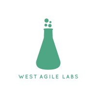
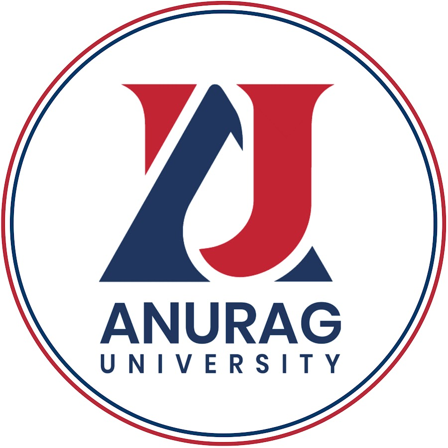

# Experience

## Featured Experience

---

### 

### MastersCoding — Founder & Chief Instructor  
**Oct 2019 – Present · Hyderabad, India**

Founded and leading an AI-powered Full Stack Development training platform focused on building industry-ready software engineers through a backend-first learning approach.

#### Key Highlights
- Designed and delivered comprehensive training programs on:
  - JavaScript
  - Node.js
  - Express.js
  - MongoDB
  - React.js
  - REST APIs
  - Authentication & Authorization
  - AI-integrated web applications

- Mentored students on:
  - Real-world project architecture
  - API development workflows
  - Database design
  - Debugging techniques
  - Deployment strategies
  - Clean coding practices

- Integrated modern AI capabilities into full stack applications including:
  - Semantic search
  - AI-powered assistants
  - Summarization systems
  - Intelligent application workflows

- Trained:
  - Engineering students
  - Fresh graduates
  - Working professionals

- Focused heavily on practical implementation, hands-on coding, backend architecture, and industry-level engineering workflows.

---

### 

### Cognizant — Full Stack Web Development Instructor *(Freelance Partner)*  
**Jan 2020 – Present · Hybrid**

Delivered corporate training programs for engineers on modern full stack web development technologies and backend application architecture.

#### Key Highlights
- Conducted instructor-led training on:
  - MERN Stack
  - MEAN Stack
  - Express.js
  - MongoDB
  - Node.js
  - React.js

- Mentored engineers on:
  - Enterprise backend architecture
  - REST API development
  - Authentication systems
  - CRUD application development
  - Database modeling
  - Deployment workflows

- Helped developers strengthen practical coding skills through:
  - Real-world project implementation
  - Hands-on debugging sessions
  - Scalable application development practices

- Contributed to corporate upskilling initiatives focused on modern JavaScript ecosystems and backend engineering practices.

---

### 

### Circular Edge — Software Engineer  
**2013 – Feb 2017 · Chennai, India**

Worked as a Java backend developer building enterprise applications and RESTful services using modern software engineering practices.

#### Key Highlights
- Developed backend applications using:
  - Java
  - Spring Boot
  - RESTful Web Services

- Participated in:
  - Agile development processes
  - Team collaboration workflows
  - Backend feature implementation
  - API integration

- Contributed to scalable enterprise application development and maintenance.

- Gained strong exposure to:
  - Backend architecture
  - Production-level development
  - Debugging and troubleshooting
  - Software engineering best practices

---

# Training Collaborations

| Logo | Organization | Role | Duration |
|---|---|---|---|
|  | VNR Vignanajyothi Institute of Engineering & Technology | Full Stack Instructor | Feb 2018 – Present |
|  | Wipro | Full Stack Web Instructor | Sep 2024 – Jan 2025 |
|  | West Agile Labs | Full Stack Instructor | Feb 2023 – Apr 2023 |
|  | Second Campus | Chief Instructor | May 2017 – Dec 2020 |
|  | Anurag University | Freelance Trainer | Dec 2025 – Mar 2026 |

---

# Career Highlights

- 10+ years of mentoring and technical training experience
- Industry experience in enterprise backend development
- Corporate training experience with leading organizations
- Specialized in backend-first full stack engineering education
- Strong focus on practical project development and modern web architecture
- Experience integrating AI capabilities into full stack web applications
- Passionate about building industry-ready developers through hands-on learning

---

# Trusted By

